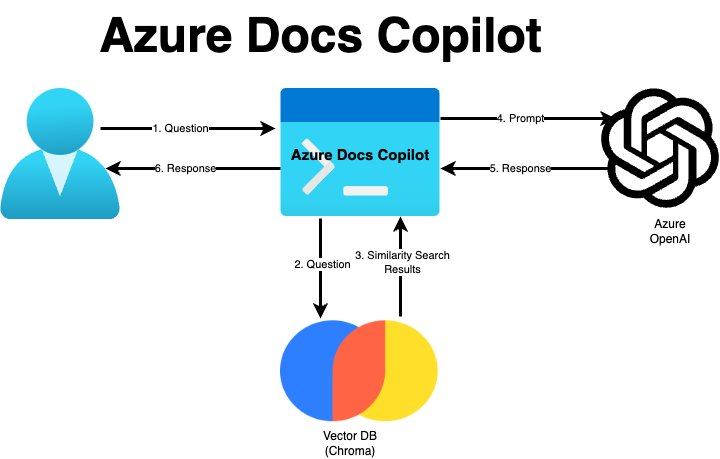

# Azure Docs Copilot

## What is Azure Docs Copilot?

Azure Docs Copilot is a Generative AI App that lets a user search Azure documentation using natural language.

For example, a user can ask questions like:

- Name the different kinds of blobs in Azure Storage?
- What is the size of the partition key in Cosmos DB?
- Explain vector search capability in Azure Cognitive Search.

## How it works?

In the current version, it's a very simple application that makes use of Retrieval Augmented Generation (RAG) 
technique to perform similarity search on a vector database containing the contents of Azure documentation.

The result of the similarity search and the user's question are then fed to a Large Language Model (LLM) which
provides an answer to the user's question.

Following diagram shows the overall architecture of the application.



Here is how it works:

1. User asks a question to the application.
2. The question is sent to a Vector Database where a similarity search is performed on the user's question.
3. Vector database returns matching results to the application.
4. Application then combines the matching results and the user question and sends it to the LLM.
5. LLM prepares a response based on the prompt and sends it back to the application.
6. User is shown the response.

## Pre-requisites

- **Python 3**: This is a console app that makes use of Python 3. Please make sure that Python 3 is installed on the 
user's computer. Python 3 can be downloaded from [https://www.python.org/downloads/](https://www.python.org/downloads/).
- **Azure Open AI**: This application makes use of Azure Open AI. Please ensure that the user has access to Azure Open AI.

## Setup

Here are the setup steps that must be completed before the application can be used:

### 1. Clone/download repository
First step would be to clone or download this repository.

### 2. Install dependencies
Next step would then be to install the dependencies. You can install the dependencies using `pip`.

```
pip install -r requirements.txt
```

If needed, a virtual environment can be created for this application before installing the dependencies.
Instructions for setting up a Python virtual environment can be found here: 
[https://docs.python.org/3/library/venv.html](https://docs.python.org/3/library/venv.html)

### 3. Download Azure documentation repository
In the current version, this application requires that the Azure documentation is downloaded locally.
Azure documentation is available on GitHub and can be downloaded from 
[https://github.com/MicrosoftDocs/azure-docs](https://github.com/MicrosoftDocs/azure-docs).

After downloading the documentation, unzip the file and copy the contents of `articles` folder there.
Make a directory called `data` in the application root folder and paste the contents inside that directory.

### 4. Azure OpenAI setup
As mentioned above, the application makes use of Azure OpenAI. Before the application can be used, 
Azure OpenAI must be set up. The application requires 2 AI models to be deployed:

- **Model for embedding**: Use `text-embedding-ada-002` for that purpose. This is required for creating embeddings for vector database.
- **Model for chatting**: Use GPT 3.5 or GPT 4 for that purpose.

Note down the following information from Azure OpenAI environment:
- Azure OpenAI endpoint and key.
- Deployment names for embedding and chatting models.

### 5. Setup environment variables
Create a file called `.env` in application root folder and copy the following text in that file:

```
OPENAI_API_TYPE="azure"
OPENAI_API_BASE="<Azure-OpenAI-Endpoint>"
OPENAI_API_KEY="<Azure-OpenAI-Key>"
OPENAI_API_VERSION="2023-05-15"
CHROMA_DB_PATH="datastore/vector-db"
AZURE_OPENAI_EMBEDDING_MODEL_NAME = "text-embedding-ada-002"
AZURE_OPENAI_EMBEDDING_MODEL_DEPLOYMENT_NAME = "<Embedding-Model-Deployment-Name>"
AZURE_OPENAI_CHAT_MODEL_DEPLOYMENT_NAME = "<Chat-Model-Deployment-Name>"
```

Replace `<Azure-OpenAI-Endpoint>`, `<Azure-OpenAI-Key>`, `<Embedding-Model-Deployment-Name>` 
and `<Chat-Model-Deployment-Name>` with appropriate values from step 4 above.

### 6. Setup Vector database
Before the application can be used, a Vector database must be populated with the Azure documentation contents.
To setup the vector database, open the terminal in the project directory and run the following command:

```
python3 src/setup.py
```

This script will read all the markdown files from the `data` folder and then populate the vector database. 

**Note: Please note that currently the application reads one file at a time so it may take a while for this whole 
process to complete.**

## Running the application

Once the setup is complete, application can be accessed by running the following in the terminal:

```
python3 src/index.py
```


